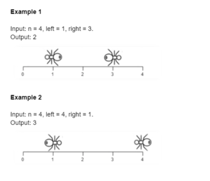
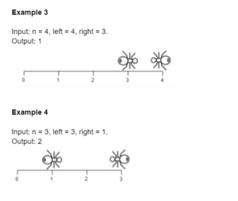

У нас есть деревянная доска длиной n единиц.
По доске ходят два муравья, каждый муравей движется со скоростью 1 единица за раунд. Один муравей движется влево, другой движется вправо. За один раунд каждый муравей делает ход. Муравей, идущий влево, движется первым.
Если муравей собирается двигаться в точку, которая уже занята другим муравьем, то каждый из муравьев меняет направление, и только после этого движется текущий муравей. Предположим, что смена направления не занимает дополнительного раунда. Также муравьи не могут занимать одно и то же положение на доске.
Когда муравей достигает одного конца доски и движется к ее концу, он не падает с доски сразу, это происходит в следующем раунде.

Дано целое число n — длина доски и два целых числа: left — положение муравья, который движется влево, и right — положение муравья, который движется вправо. Верните количество раундов, необходимых для того, чтобы первый муравей выпал с доски.

Constraints:
1 <= n <= 10^4
0 <= left <= n
0 <= right <= n
left != right

Напишите реализацию следующего метода на Java, который, принимает значения n, left, right, и возвращает по заданным данным правильный ответ по условию задачи:

public int calculate(int n, int left, int right) {
    // your code here
}